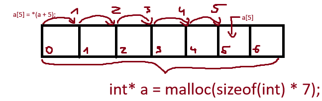

C-ben lehetőségünk van manuálisan memóriát kérni az OS-től. Ezt a `malloc` függvénnyel tehetjük meg.
`void *malloc(size_t size);` - a függvény egy `void*` típust ad vissza. Ezzel még nem feltétlen találkoztunk. A void pointer lényege, hogy minden más pointer típussá kovertálható. a `size` paraméter a kért memória mérete, byteban.

Például:
```c
#include <stdlib> //malloc itt lakik

int main(void){
    int* a = malloc(sizeof(int)); // int méretű memóriát kérünk
    *a = 5;
    printf("%d", *a);
    return 0;
}
```

Aki szemfüles és esetleg már dolgozott manuálisan memóriával, annak feltűnhet valami. Ez a valami pedig az, hogy a `malloc` hívással lefoglalt memória dinamikus élettartamú, a scope végén nem szabadul fel automatikusan, így felszabadítatlan memória van a programunkban. Ezt memóriaszivárgásnak hívják. Jelen esetben ez nem okoz borzasztó hibát, hiszen a program végén az OS visszaveszi a memóriát, azonban ha mondjuk egy textúrát a felülírása előtt nem szabadítunk fel, és annak pointere kimegy a scopeból, ott potenciálisan megabyteokat szivárogtatunk el akár minden képkocka után.

```c
#include <stdlib> //malloc itt lakik

int main(void){
    int* a = (int*)malloc(sizeof(int)); // int méretű memóriát kérünk, a kapott void* -t castoljuk int* -á
    *a = 5;
    printf("%d", *a);
    free(a); //szabadítsuk fel az 'a' által mutatott memóriát mielőtt az 'a' pointer kimegy a scopeból
    return 0;
}
```

Mint már említettem, a `malloc` hívással foglalt memória élettartama dinamikus, ezt pedig felhasználhatjuk arra, hogy egy függvényből "kijuttassunk" adatot, habár ez nem túl előnyös.

```c
foo* pelda_malloc(){
    foo* to_return = (foo*)malloc(sizeof(foo));
    to_return->a = 5;
    to_return->b = 10;
    return to_return;
}

//de ezt lehetne így is, ún output paraméter használatával:

void pelda_outparam(foo* f){
    foo to_return;
    to_return.a = 5;
    to_return.b = 10;
    *f = to_return;
}
```

A dinamikus memória akkor hasznos még, ha futásidőben derül ki, pl. egy tömb mérete:
[runtime_meretu_tomb.c](example/runtime_meretu_tomb.c) :
```c
#include <stdio.h>
#include <stdlib.h>

int main(){
    int tomb_meret = 1;
    printf("Mekkora tömböt kérsz?: ");
    scanf("%d", &tomb_meret);
    int* tomb = (int*) malloc(sizeof(int) * tomb_meret);
    /*csinalunk valami a tombbel*/
    tomb[0] = 1; //az indexelő ([]) operátor gyakorlatilag csak egy eltolást alkalmaz a pointer által mutatott memória elejére, majd dereferálja a kapott címet. Lásd a lenti képet.
    free(tomb);
}
```

Fontos azt megjegyezni, hogy a malloc által visszaadott pointerek, és általában is a pointerek **nem tárolják magukban az általuk mutatott memóriát**. A pointer csak egy hivatkozási mód egy memóriaterületre. 
