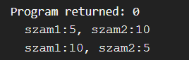

## Pointer

A C nyelv egy sajátossága, hogy a memóriát általános változókon kívül pointerekkel is elérhetjük.<br>
Egy pointer gyakorlatilag felfogható egy memóriacímként, valamint más, változó metaadatokként.

Egy változóra pointert az "address-of" operátorral: & (Ampersand, And jel, gyakorlatvezetőknél néha "At" jel) kaphatunk.
A pointer önmaga egy típus. Pl. egy változónak lehet int pointer a típusa. Ezt a következőképp jelöljük: `int* p;`
```c
#include <stdio.h>

int main(void){
    int a = 5;
    int* pa = &a; // pa nevű változó típusa int*, értéke az a-ra mutató pointer

    printf("a value:%d\na address:%p\n", a, pa); //a %p format specifier a pointer által mutatott címet írja ki.
    return 0;
}
```

## Mire jó egy pointer? Cím szerinti paraméterátadás

Tegyük fel, hogy egy egyszerű függvényt szeretnénk megvalósítani: `int_swap()`<br>
Az egyetlen dolga, hogy megcserél két egész számot két változóban. 
Első próbálkozásunk talán a következő lenne:
```c
void int_swap(int a, int b){
    int tmp = a;
    a = b;
    b = tmp;
}
```
Ezzel azonban van egy kis probléma. Amikor a függvényt meghívjuk, a változók bemásolódnak az `a` és `b` paraméterekbe, viszont így amikor a paramétereket változtatjuk, az eredeti változók nem változnak meg.<br>
Ekkor használhatjuk a pointereket, hiszen ezek gyakorlatilag memóriacímek. Ebben a rövid kódrészletben megismerjük a pointer által mutatott memória elérésének módját is.
```c
void int_swap(int* a, int* b) { //két db int* -ot veszünk paraméterként
    int tmp = *a; //a dereferencia(*) operátor a pointer által mutatott memóriát adja vissza, ez esetben az 'a' pointer mögötti egész számot
    *a = *b; //*a -> az a mögötti egész = *b -> b mögötti egész
    *b = tmp; //*b -> b mögötti egész = tmp, *a régi értéke.
}
```

A fenti példából azt láthatjuk, hogy mindenképp szükdégünk van pointerekre, ha azt szeretnénk, hogy a függvényünk megváltoztassa a paraméterként kapott értékeket.

pl:<br>
[swap.c](example/swap.c)
```c
#include <stdio.h>

int main(void){
    int szam1 = 5;
    int szam2 = 10;
    printf("szam1:%d, szam2:%d\n", szam1, szam2); //szam1:5, szam2:10
    int_swap(&szam1, &szam2);
    printf("szam1:%d, szam2:%d\n", szam1, szam2); //szam1:10, szam2:5
}
```
Ezért szükságes a `scanf` függvénynek pointert átadni.

Kimenet:<br>


A pointerek másik hasznos tulajdonsága, hogy viszonylag kicsik, 64 bites rendszereken általában 8 byteosak.
Képzeljük el a következő szituációt:<br>
[jatekos.c](example/jatekos.c):
```c
#include <stdio.h>

typedef struct{
    int x, y;
    int w, h;
    double rotation;
    unsigned int hp;
    unsigned int ammo;
}Jatekos;

int main(void){
    printf("%zu", sizeof(Jatekos)); // 32
    return 0;
}
```

A `Jatekos` struktúra 32 byte méretű. Mint már fent említettük, amikor egy `Jatekos` -t egy függvénynek átadunk, az egész struktúra lemásolódik. Ez természetesen nagy struktúrák esetén nem előnyös.<br>
Erre a problémára is megoldás a pointerek használata.
A struktúra tagjainak eléréséhez először dereferenciát kéne rá alkalmazni, majd a `.` operátorral elérni a tagokat. Ez egy olyan gyakori eset, hogy külön operátor van rá, ez pedig a `->`(nyíl) operátor.
Például:
```c
//mozgatja a jatekost x es y mennyiseggel az x es y iranyban
void jatekos_mozgat(Jatekos* jatekos, int x, int y){
    jatekos->x += x; // ugyanaz mint (*jatekos).x += x
    jatekos->y += y; // ugyanaz mint (*jatekos).y += y
}
```
Mivel egy pointer, függetlenül attól, hogy mire mutat, mindig ugyanakkora, és 99.9%-ban kisebb, mint pl. a `Jatekos` típus, így sokkal jobb így átadni a játékost, mint érték szerint.

Természetesen egy pointer mutathat pointerre is. Tegyük fel, hogy van függvényünk, amivel egy pointert akarunk megváltoztatni(pl. láncolt lista fejét akarjuk átállítani)
```c
void reassign_pointer(int** destination, int* value){ //destination tipusa: int**, egy int pointerre mutato pointer
    *destination = value;
}
```

Fontos azt megjegyezni, hogy a pointerek **nem tárolják magukban az általuk mutatott memóriát**. A pointer csak egy hivatkozási mód egy memóriaterületre. 