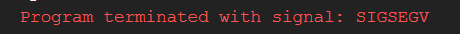
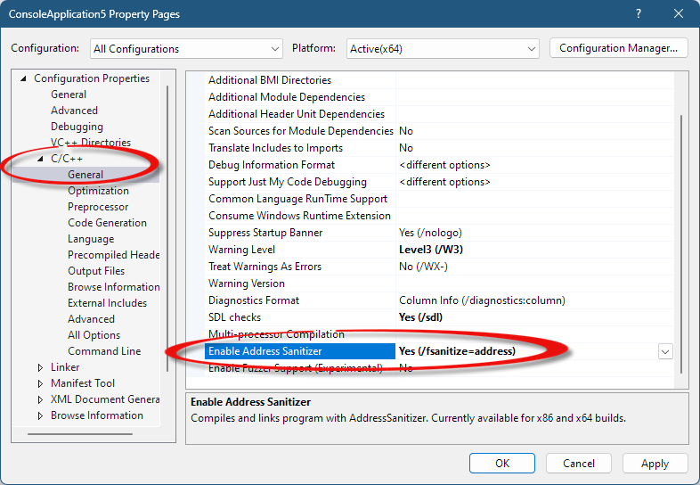

A C híres a különféle memóriahibáiról. Az egyik ilyen az ún. "Segmentation Fault". Aki programozott már mondjuk Javában, az NullReference Exceptionként már találkozhatott vele.

A Segmentation Fault, vagy másnéven segfault azonban ennél azért több. A gyakorlatban egy segfault az operációs rendszerünk egy védelmi mechanizmusa. Ha egy program olyan memóriaterületet próbál elérni, ami nem számára van fenttartva, akkor az OS egy SIGSEGV(Signal Segmentation Violation) jelet küld a programnak majd leállítja. 

A segfault egy gyakori oka a NULL pointerek dereferenciája.

Például: <br>
[null_rossz.c](example/null_rossz.c)

```cpp
#include <stdio.h>
#include <stdlib.h>

int main(void){
    FILE* f = fopen("file.txt", "r");
    char szoveg[50];
    fgets(szoveg, 49, f); //oké, de mi van ha nem nyílt meg a file??
    return 0;
}
```

A fenti kódrészletben az
```c
fopen("file.txt", "r");
```

függvény visszad egy pointert egy memóriába betöltött filera. Azonban ha a filet nem sikerült megnyitni, akkor `NULL` pointert ad vissza. Amikor ezt az `f` pointert később használjuk, akkor az 
```c
fgets(szoveg, 49, f);
```
azt várja, hogy az `f` egy valid pointer. Ezért aztán, amikor NULL pointert kap, az outputban a következőt látjuk:<br>


Az ilyen hibákat a hívott függyvények dokumentációjának elolvasásával, és a visszaadott értékek ellenőrzésével lehet kiküszöbölni. 
A fenti példa kijavítva:<br>
[null_jo.c](example/null_jo.c)

```c
#include <stdio.h>
#include <stdlib.h>

int main(void){
    FILE* f = fopen("file.txt", "r");
    if(f == NULL){
        printf("Hiba a file megnyitasa kozben!\n");
        return 1;
    }
    char szoveg[50];
    fgets(szoveg, 49, f); //oké, de mi van ha nem nyílt meg a file??
    //Hát semmi, mert fent lekezeltük a hibát.
    return 0;
}
```

## Address Sanitizer

A Segmentation Fault egy másik gyakori oka a bad-access, avagy más processek, vagy garbage memory elérése. Ezeket a hibákat sokkal nehezebb megtalálni. Szerencsére erre a problémára találták ki az address sanitizereket. 

Linuxon a `-fsanitize=address` flaget a compilerhez csapva máris kapunk egy részletes dumpot a problémáról:


Szerencsére a többi sanitizerrel ellentétben az asan már windowson, a Visual Studio toolchainen keresztül elérhető. A project properties -ben az "Enable Address Sanitizer" opciót kell keresni, vagy a `/fsanitize=address` flaget hozzáadni a flagekhez.


Sajnos más toolchainen az asan jelenleg nem elérhető Windows környezetben. 