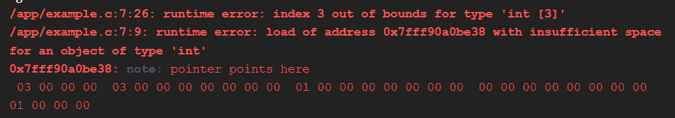

A C standard szerint minden C program viselkedése kikövetkeztethető kell legyen. Olyan viselkedés, amely ez ellen megy, több kategóriába sorolható, viszont a leggyakoribb és legfontosabb az "Undefined Behavior", vagy röviden UB.

Egy UB-t tartalmazó program kimenetele nem biztos, és *pongyola módon fogalmazva* "teljesen random" lehet a viselkedése. A fordítóprogram alapértelmezett esetben nem figyelmeztet ilyen esetekre, viszont sokszor ilyen hibák miatt nem működik a kódunk.

Egy nagyon egyszerű UB példa:

```c
#include <stdio.h>
#include <stdlib.h>

int main(void){
    int tomb[] = {1, 2, 3};
    for(size_t i = 0; i < 4, ++i){
        printf("%d", tomb[i]);
    }
}
```

A ciklus negyedik iterációjára `i=3`, így a tömböt a `printf` hívásban "out-of-bounds" indexeljük. Ekkor a program viselkedése nem biztosított. Elképzelhető, hogy a programunk `SIGSEGV` jelzéssel leáll, vagy esetleg felülír egy másik változót a saját memóriaterületéből.

## UB sanitizer

Linux operációs rendszeren elérhető az ún. "Undefined sanitizer". 
Ez a hasznos kis eszköz képes a legtöbb UB esetet megtalálni a kódban.

Használata egyszerű, mindössze az `-fsanitize=undefined` flaget kell a compilernek adni, azaz egy egyszerű programnál:
`gcc main.c -o main -fsanitize=undefined`

Itt egy példa: <https://godbolt.org/z/z9YbjhGGT>
Jobb alul kapunk egy gyönyörű outputot:<br>


