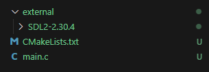

# SDL2 használata CMake segítségével, könyvtárak C-ben

Ez a doksi egy viszonylag hosszú, viszont remélhetőleg extenzív megértést biztosít a C(és C++) könyvtárak működéséhez és használatához.<br>
Megj.: A C nyelvben nem a nyelvhez, hanem az adott rendszerhez natív könyvtárakat használunk. Ez azt jelenti, hogy Linux rendszer alatt működő library nem fog Windowson működni.<br>Általában: .a, .so -> Linux | .lib, .dll -> Windows | A .a formátumot egyes Windows fordítók elfogadják, viszont Linuxról szerzett binaryk ekkor sem fognak működni!

## Könyvtárak (libraryk)

### Linkelés, szimbólumok, stb.

A C build 'toolchain' 3 absztrakt elemre bontható: Preprocesszor->Fordítás->Linkelés<br>
A Preprocesszor feladatát egy másik doksiban tárgyaljuk.<br><br>
A fordítási lépés feladata a kód ellenőrzése, szintaktikai hibák jelzése, stb... ezt a szakaszt nevezzük "fordításidőnek"(compile-time)<br>
Fordításidőben az egyes szimbólumok definícióira nincs szükség. A minimális információ gyakorlatilag minden szimbólum mérete, azaz függvényeknél és változóknál a deklaráció, típusoknál a definíció. Ezért is működik az alábbi kódrészlet:
```c

#include <stdio.h>

void foo(void);

int main(){
    foo(); //A fordító lépést nem érdekli mit csinál foo()
    return 0;
}

void foo(void){
    printf("Hello, World!");
}
```
A szimbólumok definíciójának hozzárendelését a *linker* végzi. A definíciókat .o, .a, .lib, stb. fileok tárolják(utóbbiak a könyvtárak "archive" filejai), viszont madártávlatból ezek ugyanúgy működnek. A linker ránéz a programban található szimbólumokra, és kikeresi a hozzá tartozó definíciót. Ha ezt nem találja, akkor(msvc compilerrel kicsit érdekesebb) `Undefined reference to foo(void)` vagy hasonló hibaüzenetet kapunk. Például a:

```c
#include <stdio.h>

void foo(void);

int main(){
    foo(); //A fordító lépést nem érdekli mit csinál foo()
    return 0;
}
```
kódrészlet lefordul, ha csak azt kérjük, viszont futtatható programot nem fogunk tudni csinálni belőle, hiszen `foo()` -nak hiányzik a definíciója.

### Könyvtárak 

Linuxon és MacOS-en nem probléma a könyvtárak telepítése, a distribution package managere általában jó munkát végez. 
Pl:
```
sudo apt-get install libsdl2-dev
```
Windowson azonban más a helyzet. Általában a könyvtár [github release](https://github.com/libsdl-org/SDL/releases/tag/release-2.30.6)-jei, vagy a könyvtár weboldalán a download opciók közt kell keresgélni.

Amikor egy könyvtárat telepítünk(nem forráskódból való buildeléssel), akkor általában 2-3 ilyesmi mappát/fileokat, kapunk: 
* include mappa, header(`.h`) fileokkal
* bin mappa, .dll/.so fileokkal(nem feltétlenül jön a könyvtárral, ld. később)
* lib mappa, .a/.lib fileokkal

A headerek már a fentebb említett minimális információt hordozzák. A bin és lib mappa tartalma pedig a definíciókat hordozza.

### Dynamic vs Static

A definíciók linkelése kétféleképp történhet: statikusan(static) és dinamikusan(dynamic/shared).

#### Static linking:

Egy statikus könyvtár gyakorlatilag több object file egyben. Amikor statikusan linkelünk egy könyvtárat, akkor az abban található definíciók közvetlen a programba kerülnek. Ennek előnyei, hogy a könyvtárat nem kell a programmal együtt továbbadni. Hátránya az, hogyha a könyvtár változik, akkor a programot is újra kell fordítani.

Fájltípusok:<br>
* Windows: .lib, .a(MinGW)
* Linux: .a

### Dynamic linking

Egy dinamikus könytár egy executablehez hasonló file. A definíciók futásidőben töltödnek be, nem buildeléskor. Előnye, hogy könnyen kicserélhető a könyvtár egy újabb verzióra, vagy akár futásidőben betölthetőek más definíciók(lásd: [dll injection](https://en.wikipedia.org/wiki/DLL_injection)). Hátránya, hogy az OS számára megtalálható helyen kell a könyvtárat a programmal továbbadni. Ez windowson nagy problémát okozhat, hiszen sokszor a könyvtáraink nem egy általános, PATH környezeti változóban szereplő mappában vannak(lásd: [DLL Hell](https://en.wikipedia.org/wiki/DLL_Hell)).

Fájltípusok:<br>
* Windows: .dll, .lib/.a(bővebben lent)
* Linux: .so

Windowson a definíciók importálása kicsit furcsán működik, ezért ott szükség van egy statikus könyvtárra, ami a linkert arra utasítja, hogy forduljon a dll-hez:<br> 
```
"Windows is a bit odd when it comes to using shared libraries. you need that small static library as the middleman. On linux you link to the shared object directly as all the symbol information is in the file itself" - Mr-y 
```

### Könyvtárak linkelése

Parancssoros fordítással:

```
gcc main.c -o main -I ./include -L ./lib -lSDL2
```

A `-I` flag a header fileok helyét adja meg. Pl. jelen esetben az `include` mappában(relatívan a terminál current directoryjához) vannak a headerek.
A `-L` flag a library fileok helyét adja meg. (!Windowson ez nem jelenti azt, hogy a dll-eket itt fogja keresni a rendszer!)
A `-l` flag után a linkelendő library neve következik. Filename általában nem szükséges.

CMake:

A CMake a saját, "package" alapú rendszerét használja. Ez a gyakorlatban azt jelenti, hogy egy konkrét file helyett a CMakeLists.txt -ben egy targethez linkelünk, nem pedig egy konkrét filehoz. Ehhez az szükséges, hogy a libraryval jöjjön egy `név-config.cmake` és egy `név-config-version.cmake` file. Ez általában egy cmake nevű mappában található. Ekkor a `find_package` és `target_link_libraries` függvényekkel egyszerűen linkelhető a könyvtár. A targetek neve sajnos változó, ekkor az adott könyvtár github readme-jében/weboldalán szokott példa CMakeLists.txt lenni. A CMake számára a default package mappák mellé a `CMAKE_PREFIX_PATH` lista bővítésével adhatunk újabb mappákat.

#### CMake SDL2 példa

Az [example](example/) mappában található egy példa cmake setup az SDL2 statikus linkelésére. Ehhez az SDL2 package managerből való telepítésére, vagy az SDL[github release](https://github.com/libsdl-org/SDL/releases/tag/release-2.30.6)-jeiből letöltött archiveot az `external`(relatív a CMakeLists.txt -hez) mappába való kicsomagolására van szükség.<br>


