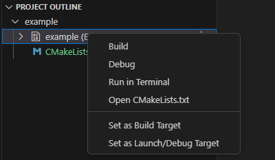

## Ajánlott platformok

Linux, *MacOS*

## CMake

A CMake egy meta-build system. Ez azt jelenti, hogy önmagában nem funkcionális, szükség van mellé egy C compilerre és egy build systemre is. C compilert az ajánlott OS-ekre a repo `GNU GCC setup` mappájában találhatsz. Emellé szükség lesz még egy build systemre.  
Egy egyszerű de nagyon gyors build system a `Ninja`. Ezt a distributionünk package managerjéből telepíthetjük.

## C/C++ extension pack

A legfontosabb extensionöket a [C/C++ extension pack](https://marketplace.visualstudio.com/items?itemName=ms-vscode.cpptools-extension-pack) tartalmazza. 

## Miért pont cmake?

A VS Code beépített task rendszere elég janky egy normális build system nélkül.

## CMake setup

Készítsünk egy `main.c` és egy CMakeLists.txt filet.
[Példa setup itt.](example/)

Ha minden kész, akkor a bal oldali menüből a CMake menüt választva 
 
majd a "Project Outline" részen az `example` targetre jobb kattintás után a "Run in terminal" opciót választjuk. 
